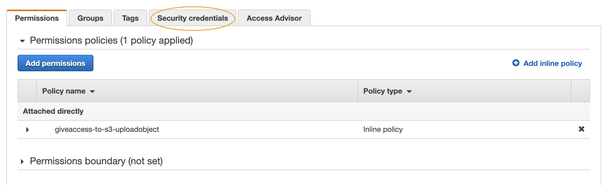
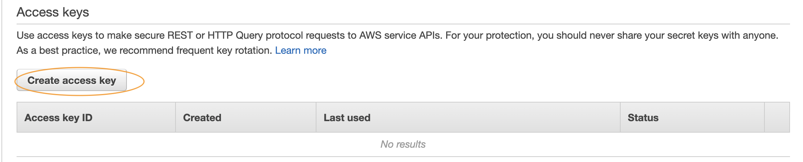
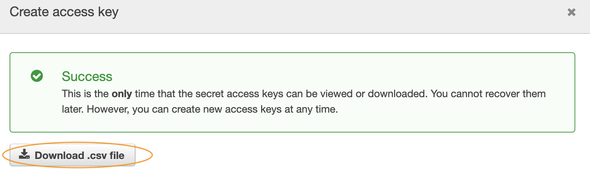
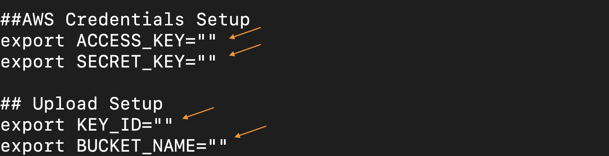
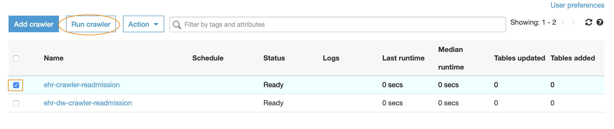
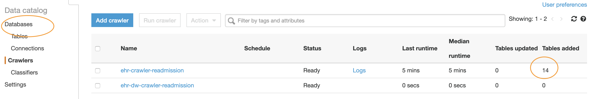
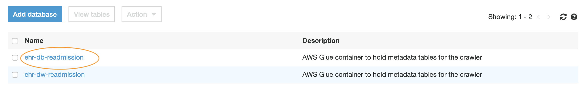
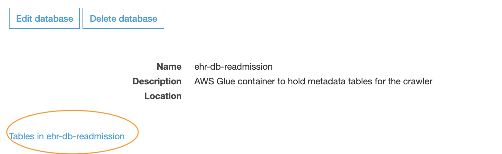

- After the stack is successfully created. Get **ACCESS_KEY** and **SECRET_KEY** for the created IAM user **s3upload**. [Click on this link to open the console](https://console.aws.amazon.com/iam/home?#/users/s3upload). You can follow the instructions [here](https://docs.aws.amazon.com/IAM/latest/UserGuide/id_credentials_access-keys.html#Using_CreateAccessKey) to create `ACCESS_KEY` and `SECRET_KEY` for the user. Once created, download the credentials. Screenshots below can also guide you through the process of creating credentails. This IAM user is required to upload the raw data to required S3 bucket.

- Download [upload data script](upload_data.sh) to your local system that can be used to upload the generated data to S3 bucket. Copy this script to **“output/csv”** directory  of synthetic data generation tool. You need to then update the script as - **ACCESS_KEY** and **SECRET_KEY** from the downloaded credentials file  and **KMS KeyId** and **S3 Bucket name** from CloudFormation output. 

- Run the upload data script `./upload_data.sh` after updating the values. This script will upload all the generates CSV files to S3 bucket.

- You can now login to [AWS console](https://console.aws.amazon.com/glue/home?region=us-east-1#catalog:tab=crawlers) to run AWS Glue crawler, look for the crawler named **ehr-crawler-readmission** (default name provided in CloudFormation) and run the crawler. Once the crawler is successfully run i.e. the attribute **Tables Added** will be updated to the number of tables discovered by the crawler. Below screenshots can guide you through the process.

- Click on Databases in AWS Glue console and look for database named **ehr-db-readmission**(default name provided in CloudFormation) and click on it. You can then click on the link `Tables in ehr-db-readmission` to check the available tables and associated properties. 

