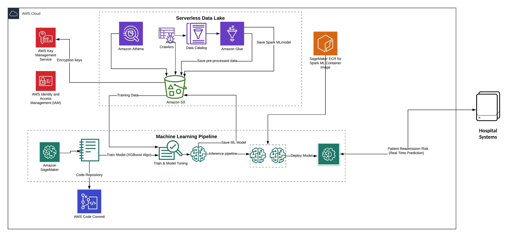

# All Cause Patient Re-admission Risk Prediction System
## AWS Data Lake and Machine Learning

Architects and ML Developers are looking for ways to build **Hospital Re-admission Risk Prediction system** for their use case. You will see the *reference architecture* to quickly develop end-to end machine learning solution for ‘All Cause Hospital Re-admission Prediction System’ using large EHR data sets. The purpose is not to provide machine learning algorithm or data sets for the problem but to show how different AWS services can be used together to build the prediction system. This solution includes data ingestion, data exploration, feature selection, feature engineering, data pre-processing, training ML models, performance optimization of the model, deploying the model in the form of inference pipeline and provide real time prediction for provided input data set. Having access to representative data is very essential for any machine learning problem. Since real healthcare data is highly regulated, we are going to use **[Synthetic Patient Population Simulator](https://academic.oup.com/jamia/article/25/3/230/4098271)** to generate synthetic and realistic EHR data. This tool provides flexibility to generate data sets for varied population sizes, geographic regions, demographics and many other configurable items as mentioned in synthea.properties file. You can refer to the [steps mentioned on this page](https://github.com/synthetichealth/synthea/blob/master/README.md) for the latest instructions to download, install and generate the data set. 

In a nutshell, you need to-
*	Install Java and clone the Git repo 
*	Verify the installation 
*	Update **src/main/resources/synthea.properties** file to generate files in csv format. Ensure that the property exporter.csv.export is set to true (exporter.csv.export = true)
*	Run the tool (specifying population size) to generate data set (For example, ./run_synthea -p 10000). The latest command can be found on this [page](https://github.com/synthetichealth/synthea/blob/master/README.md)

This will generate the data set in **“output/csv”** directory of the cloned directory structure. Some of the files generated by the tool are *imaging_studies.csv, allergies.csv, payer_transitions.csv, patients.csv, encounters.csv, conditions.csv, medications.csv, careplans.csv, observations.csv, procedures.csv, immunizations.csv, organizations.csv, providers.csv and payers.csv*. These files contain standard EHR data. To understand the data dictionary of the generated data set, you can refer to this [link](https://github.com/synthetichealth/synthea/wiki/CSV-File-Data-Dictionary).

We have used synthetic data generated by the tool but you have the flexibility to use your own data with this reference architecture and modify scripts in *glue_scripts* directory to generate model training data set. 

### Let’s look at the reference architecture

In this reference architecture-
* [Amazon S3](https://aws.amazon.com/s3/) is used to store raw data sets, pre-processed training and test data sets and machine learning model artifacts
*	[AWS Glue](https://aws.amazon.com/glue/) is used to catalog the schema, converting csv into parquet, feature selection, feature engineering and generate Spark Machine Learning (ML) model for building inference pipeline.
*	[Amazon Athena](https://aws.amazon.com/athena/) to run ad-hoc queries to understand the data set and identify relationship between different values and attributes within the data.
*	[Amazon SageMaker](https://aws.amazon.com/sagemaker/) to provision Jupyter notebook which will be used to train the required machine learning model, model hyper parameter tuning, create SageMaker model artifacts and deploy real time prediction inference pipeline. 
*	[AWS Key Management Service (KMS)](https://aws.amazon.com/kms/) to protect the data at rest and control data access by different AWS services.

Since you will need HIPPA compliance for Healthcare data, the architecture in based on [AWS HIPPA eligible services](https://aws.amazon.com/compliance/hipaa-eligible-services-reference/). You can create all the resources required for this solution using CloudFormation template. 

#### Pre-requisites
- [Create AWS Account](https://aws.amazon.com/premiumsupport/knowledge-center/create-and-activate-aws-account/)
- [Create AWS IAM User](https://docs.aws.amazon.com/directoryservice/latest/admin-guide/setting_up_create_iam_user.html)
- [Install AWS CLI on local system](https://docs.aws.amazon.com/cli/latest/userguide/install-cliv2.html)
- [Setup AWS user credentials](https://docs.aws.amazon.com/cli/latest/userguide/cli-chap-configure.html#cli-quick-configuration) to create required AWS resources

#### Instructions
* Download [readmission-blog-cfn.yml](cfn-templates/readmission-blog-cfn.yml) to your local system
* Run the CLI command from current directory to create the stack

``
aws cloudformation create-stack --stack-name re-admission-blog --template-body file://readmission-blog-cfn.yml --capabilities CAPABILITY_IAM
``

The steps which you need to follow for creating and deploying machine learning model from the above generated data are as follows

* Understanding of your data
* Storing and converting your data into Parquet for optimized performance and storage
* Feature selection and feature engineering using Apache Spark
* Data pre-processing - StringIndexer and OneHotEncoding to convert categorical variables into required training data
* Train Spark ML model for data pre-processing and serialize using MLeap library to be used during Inference Pipeline
* Convert the data set into XGBoost supported format i.e. CSV from Spark Data Frame
* Split the data set into training and validation for model training and validation
* Train XGBoost Model using SageMaker XGBoost algorithm and validate model prediction using validation data set
* Tune the trained model using Hyperparameter tuning jobs
* Get the best tuned model and create inference pipeline which includes Spark ML model and XGBoost Model
* Create the end point configuration to deploy the inference pipeline
* Deploy the inference pipeline for real time prediction
* Invoke real time prediction API for a request.

