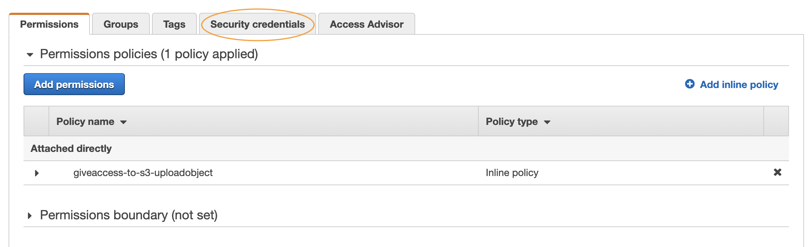
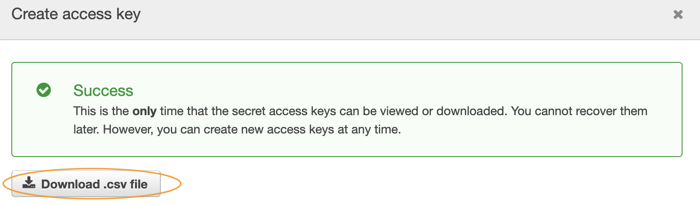
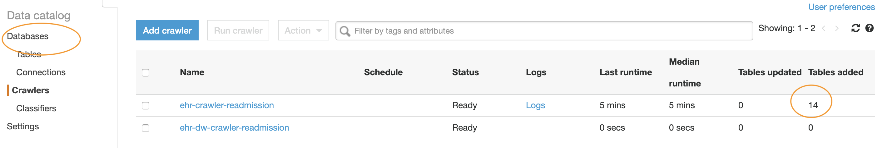
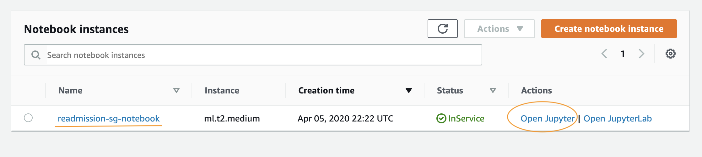
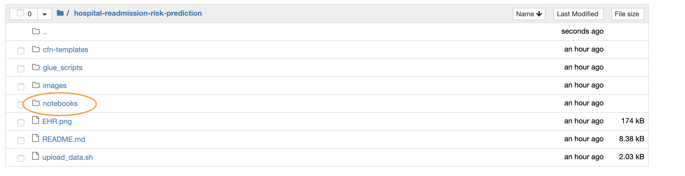
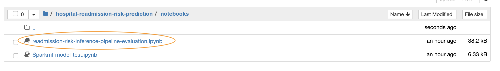

# Predicting all cause Patient Readmission Risk using AWS data lake and Machine Learning

Architects and Developers throughout the healthcare ecosystem are looking to build a Hospital Readmission Risk Prediction system that will improve patient care, lower the cost of care and ultimately increase the providers Medicare reimbursement. The purpose of this reference architecture is not to provide machine learning algorithm or data sets for the problem but to show how different AWS services can be used together to build the prediction system. This solution includes data ingestion, data exploration, feature selection, feature engineering, data preprocessing, and training ML models. It also includes performance optimization of the model, deployment of the model as an inference pipeline, and real-time prediction for the provided input dataset. Having access to representative data is essential for any machine learning problem. Since real healthcare data is highly regulated, we are going to use **[Synthetic Patient Population Simulator](https://academic.oup.com/jamia/article/25/3/230/4098271)** to generate synthetic and realistic EHR data for the purpose of understanding this reference solution. This tool provides flexibility to generate data sets for varied population sizes, geographic regions, demographics and many other configurable items as mentioned in synthea.properties file. You can refer to the [steps mentioned on this page](https://github.com/synthetichealth/synthea/blob/master/README.md) for the latest instructions to download, install and generate the data set. 

### Synthetic Data Generation 
In a nutshell, you need to-
- Install **Java** and clone the [Git repo](https://github.com/synthetichealth/synthea.git) 
- Verify the installation 
- Update **src/main/resources/synthea.properties** file to generate files in csv format. Ensure that the property exporter.csv.export is set to true (exporter.csv.export = true)
- Run the tool to generate data set (For example, ./run_synthea -p 10000). The latest command can be found on this [page](https://github.com/synthetichealth/synthea/blob/master/README.md)

This will generate the data set in **“output/csv”** directory of the cloned directory structure. Some of the files generated by the tool are *imaging_studies.csv, allergies.csv, payer_transitions.csv, patients.csv, encounters.csv, conditions.csv, medications.csv, careplans.csv, observations.csv, procedures.csv, immunizations.csv, organizations.csv, providers.csv and payers.csv*. These files contain standard [EHR](https://www.cms.gov/Medicare/E-Health/EHealthRecords) data. To understand the data dictionary of the generated data set, you can refer [here](https://github.com/synthetichealth/synthea/wiki/CSV-File-Data-Dictionary).

**Note - Here you have generated synthetic data generated by the tool but you have the flexibility to use your own data with this reference architecture and modify scripts in `glue_scripts directory` to generate training data set.**

### Let’s look at the reference architecture

In this reference architecture-
* [Amazon S3](https://aws.amazon.com/s3/) is used to store raw data sets, pre-processed training and test data sets and machine learning model artifacts
*	[AWS Glue](https://aws.amazon.com/glue/) is used to catalog the schema, converting csv into parquet, feature selection, feature engineering and generate Spark Machine Learning (ML) model for building inference pipeline.
*	[Amazon Athena](https://aws.amazon.com/athena/) to run ad-hoc queries to understand the data set and identify relationship between different values and attributes within the data.
*	[Amazon SageMaker](https://aws.amazon.com/sagemaker/) to provision Jupyter notebook which will be used to train the required machine learning model, model hyper parameter tuning, create SageMaker model artifacts and deploy real time prediction inference pipeline. 
*	[AWS Key Management Service (KMS)](https://aws.amazon.com/kms/) to protect the data at rest and control data access by different AWS services.

Since you will need HIPPA compliance for Healthcare data, the architecture in based on [HIPPA eligible services](https://aws.amazon.com/compliance/hipaa-eligible-services-reference/). 

#### Pre-requisites
- [Create AWS Account](https://aws.amazon.com/premiumsupport/knowledge-center/create-and-activate-aws-account/)
- [Install AWS CLI on your local system](https://docs.aws.amazon.com/cli/latest/userguide/cli-chap-install.html)

#### Instructions

- Click on below icon to launch CloudFormation Stack in **us-east-1**

- After the stack is successfully created. Get **ACCESS_KEY** and **SECRET_KEY** for the created IAM user **s3upload**. [Click on this link to open the console](https://console.aws.amazon.com/iam/home?#/users/s3upload). You can follow the instructions [here](https://docs.aws.amazon.com/IAM/latest/UserGuide/id_credentials_access-keys.html#Using_CreateAccessKey) to create `ACCESS_KEY` and `SECRET_KEY` for the user. Once created, download the credentials. Screenshots below can also guide you through the process of creating credentails. This IAM user is required to upload the raw data to required S3 bucket.

- Download [upload data script](upload_data.sh) to your local system that can be used to upload the generated data to S3 bucket. Copy this script to **“output/csv”** directory  of synthetic data generation tool. You need to then update the script as - **ACCESS_KEY** and **SECRET_KEY** from the downloaded credentials file  and **KMS KeyId** and **S3 Bucket name** from CloudFormation output. 

- Run the upload data script `./upload_data.sh` after updating the values.

- You can now login to [AWS console](https://console.aws.amazon.com/glue/home?region=us-east-1#catalog:tab=crawlers) to run AWS Glue crawler, look for the crawler named **ehr-crawler-readmission** (default name provided in CloudFormation) and run the crawler. Once the crawler is successfully run i.e. the attribute **Tables Added** will be updated to the number of tables discovered by the crawler. Below screenshots can guide you through the process.

- Click on Databases in AWS Glue console and look for database named **ehr-db-readmission**(default name provided in CloudFormation). You can click on the link `Tables in ehr-db-readmission` to check the available tables and associated properties. 

- Now login to [AWS SageMaker Console](https://console.aws.amazon.com/sagemaker/home?region=us-east-1#/notebook-instances) and click on `Open Jupyter` link to open the Jupyter Notebook Instance provided as part of this blog. Further instructions on what needs to be done are mentioned in the Notebooks. Open the notebook **readmission-risk-inference-pipeline-evaluation** to follow the instructions. 

### Quick Summary of Model building and deploying
*The steps which you need to follow for creating and deploying machine learning model from the above generated data are as follows*

* Understanding of your data
* Storing and converting your raw data into [Apache Parquet](https://parquet.apache.org/) for optimized performance and storage
* Feature selection and engineering using Apache Spark
* Data pre-processing to convert categorical variables into required training data
** [StringIndexer](https://spark.apache.org/docs/latest/ml-features#stringindexer) 
** [OneHotEncoding](https://spark.apache.org/docs/latest/ml-features#onehotencoder-deprecated-since-230) 
* Train Spark ML model for data pre-processing and then serialize model using MLeap library to be used during [SageMaker Inference Pipeline](https://docs.aws.amazon.com/sagemaker/latest/dg/inference-pipelines.html)
* Convert the training data set into [XGBoost](https://docs.aws.amazon.com/sagemaker/latest/dg/xgboost.html) supported format i.e. CSV format from Spark Data Frame
* Split the data set into training and validation for model training and validation
* Train model using SageMaker XGBoost Algorithm and validate model prediction using validation data set
* Tune the trained model using SageMaker Hyperparameter tuning jobs
* Get the best tuned model and create SageMaker Inference Pipeline which includes Spark ML model and XGBoost Model together behind a single endpoint
* Create SageMaker Endpoint Configuration to deploy the inference pipeline
* Deploy the inference pipeline for real time prediction
* Invoke real time prediction API for a request with test data.

## Further Reading

* [Amazon S3 Performance Optimization](https://docs.aws.amazon.com/AmazonS3/latest/dev/optimizing-performance.html)
* [HIPPA on AWS Whitepaper](https://d1.awsstatic.com/whitepapers/compliance/AWS_HIPAA_Compliance_Whitepaper.pdf)
